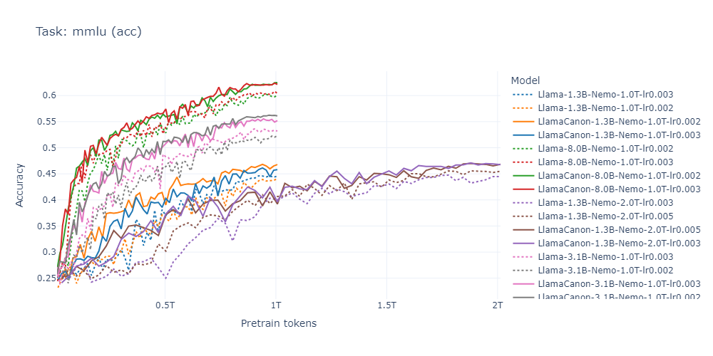
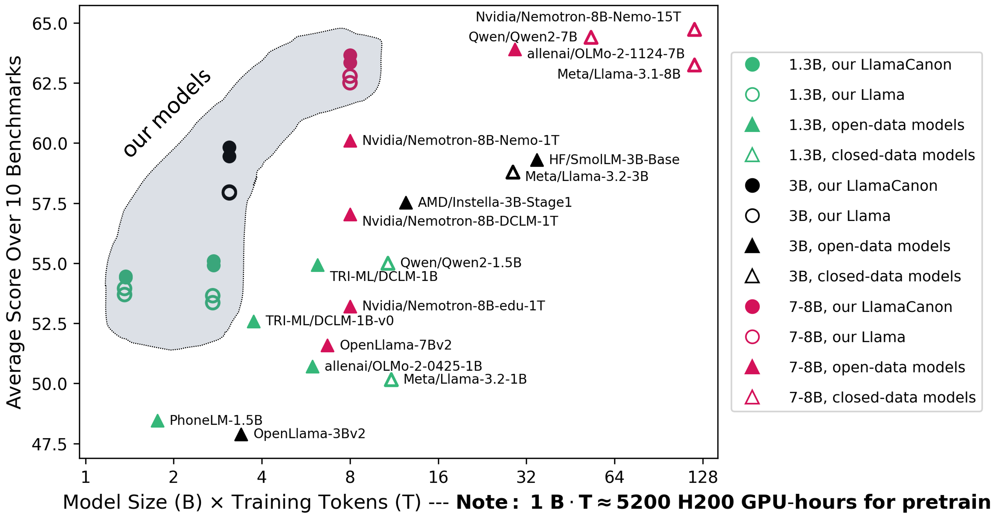

# Physics of Language Models: Part 4.2, Canon Layers at Scale where Synthetic Pretraining Resonates in Reality
[](https://physics.allen-zhu.com/part-4-architecture-design/part-4-1)
[](https://physics.allen-zhu.com/part-4-architecture-design/part-4-2)
[](https://ssrn.com/abstract=5240330)
[](https://github.com/facebookresearch/PhysicsLM4)
[](https://huggingface.co/collections/facebook/physics-of-language-models-part-42-6883fa5e7218a7369f22a806)

**Author**: Zeyuan Allen-Zhu  

Welcome to this code repository for the *Physics of Language Models* series. This repository provides all the resources required to reproduce results from the series' Part 4, as well as relevant contributions from Parts 1, 3.1, and 3.3. Below, we describe the key components of this release.

---

## 📑Repository Contents

### 🔴 Data Generators: [`data-synthetic-pretrain`](data-synthetic-pretrain/) and [`data-reallife-eval`](data-reallife-eval/)

The synthetic pretraining playground includes the **Depo**, **Brevo**, **Capo**, **Mano**, and **Lano** datasets introduced in [*Physics of Language Models: Part 4.1 — Architecture Design and the Magic of Canon Layers*](https://ssrn.com/abstract=5240330). Three are trivial to reimplement; the remaining two are provided here:

- [**Lano**](data-synthetic-pretrain/Lano-cfg/) — also featured in [*Part 1: Learning Hierarchical Language Structures*](https://ssrn.com/abstract=5250639).  
- [**Capo**](data-synthetic-pretrain/Capo-bioS-bioR/) — includes *bioS* and *bioR* generators from [*Part 3.1: Knowledge Storage and Extraction*](https://ssrn.com/abstract=5250633) and [*Part 3.3: Knowledge Capacity Scaling Laws*](https://ssrn.com/abstract=5250617).
- [**Depo**](data-synthetic-pretrain/Depo/), [**Brevo**](data-synthetic-pretrain/Brevo/), [**Mano**](data-synthetic-pretrain/Mano/) — includes *Depo1*, *Depo2*, *Brevo1*, *Brevo2* and *Mano* datasets used in [*Part 4.1: Architecture Design and the Magic of Canon Layers*](https://ssrn.com/abstract=5240330).

The real-life experiments in [*Part 4.1*](https://ssrn.com/abstract=5240330) also used the following evaluation tasks:

- [**multi-hop**](data-reallife-eval/multi-hop/) — a birth-year multi-hop in-context retrieval task, arguably the simplest and most natural real-life multi-hop benchmark.  
- [**Babilong**](data-reallife-eval/Babilong/) — slightly modified few-shot prompts from the original Babilong evaluation setup.


### 🔴 [`huggingface`](huggingface/) and [`huggingface_linear`](lingua_modified/huggingface/)
Huggingface-style models that add Canon layer supports, as highlighted in [*Physics of Language Models: Part 4.1*](https://ssrn.com/abstract=5240330):

- **Current models**:
  - **LlamaCanon**: Includes Canon layers, QK-norm, and partial RoPE support (see [`huggingface`](huggingface/))
  - **GLA** (with GLA5 modifications), **GDN** (with GDN2 modifications), and **Mamba2** models (see [`huggingface_linear`](lingua_modified/huggingface/))

### 🔴 [`lingua_modified`](lingua_modified/)
A modified version of [Meta’s Lingua codebase](https://github.com/facebookresearch/lingua) which is optimized for efficient pretraining. Key modifications include:

- For Transformer(Llama) training:
  - Added support for Canon-ABCD layers, QK-norm, z-loss, and partial RoPE for Transformer.
  - Compatibility with the above Hugging Face `LlamaCanon` model (*bonus*: a `load_from_lingua_state` method for seamless loading of Lingua state_dicts).
```bash
cd lingua_modified
python -m lingua.stool script=apps.main.train nodes=1 config=apps/main/configs/canon_1B.yaml account=<bla> qos=<bla>
```

- For Linear model (GLA/GDN/Mamba2) training:
  - Added support for Canon-AbCD layers
  - Using low-rank gating on GLA / GDN (codenames GLA5 and GDN2)
```bash
cd lingua_modified
python -m lingua.stool script=apps.gla.train nodes=1 config=apps/gla/configs/gla5_1B.yaml account=<bla> qos=<bla>
python -m lingua.stool script=apps.gla.train nodes=1 config=apps/gla/configs/gdn2_1B.yaml account=<bla> qos=<bla>
python -m lingua.stool script=apps.gla.train nodes=1 config=apps/gla/configs/mamba2_1B.yaml account=<bla> qos=<bla>
```


### 🔴 [`canon_llama_recipes`](canon_llama_recipes/)
Comprehensive training recipes (YAML files) for reproducing our 16 released Llama/LlamaCanon model weights [on Hugging Face](https://huggingface.co/collections/facebook/physics-of-language-models-part-42-6883fa5e7218a7369f22a806).
<div style="
  display: inline-block;
  transform: scale(0.9);
  transform-origin: top left;
  width: fit-content;
  white-space: nowrap;
">
<a href="https://huggingface.co/facebook/PhysicsLM4.2__Llama-1B-Nemo-1T-lr0.002">
  
</a>
<a href="https://huggingface.co/facebook/PhysicsLM4.2__LlamaCanon-1B-Nemo-1T-lr0.002">
  
</a>
<a href="https://huggingface.co/facebook/PhysicsLM4.2__Llama-1B-Nemo-1T-lr0.003">
  
</a>
<a href="https://huggingface.co/facebook/PhysicsLM4.2__LlamaCanon-1B-Nemo-1T-lr0.003">
  
</a>
<br/>
<a href="https://huggingface.co/facebook/PhysicsLM4.2__Llama-1B-Nemo-2T-lr0.003">
  
</a>
<a href="https://huggingface.co/facebook/PhysicsLM4.2__LlamaCanon-1B-Nemo-2T-lr0.003">
  
</a>
<a href="https://huggingface.co/facebook/PhysicsLM4.2__Llama-1B-Nemo-2T-lr0.005">
  
</a>
<a href="https://huggingface.co/facebook/PhysicsLM4.2__LlamaCanon-1B-Nemo-2T-lr0.005">
  
</a>
<br/>
<a href="https://huggingface.co/facebook/PhysicsLM4.2__Llama-3B-Nemo-1T-lr0.002">
  
</a>
<a href="https://huggingface.co/facebook/PhysicsLM4.2__LlamaCanon-3B-Nemo-1T-lr0.002">
  
</a>
<a href="https://huggingface.co/facebook/PhysicsLM4.2__Llama-3B-Nemo-1T-lr0.003">
  
</a>
<a href="https://huggingface.co/facebook/PhysicsLM4.2__LlamaCanon-3B-Nemo-1T-lr0.003">
  
</a>
<br/>
<a href="https://huggingface.co/facebook/PhysicsLM4.2__Llama-8B-Nemo-1T-lr0.002">
  
</a>
<a href="https://huggingface.co/facebook/PhysicsLM4.2__LlamaCanon-8B-Nemo-1T-lr0.002">
  
</a>
<a href="https://huggingface.co/facebook/PhysicsLM4.2__Llama-8B-Nemo-1T-lr0.003">
  
</a>
<a href="https://huggingface.co/facebook/PhysicsLM4.2__LlamaCanon-8B-Nemo-1T-lr0.003">
  
</a>
</div>

### 🔴 [`canon_llama_results`](canon_llama_results/)
Complete evaluation results for the 16 released Llama models:

- Strong **controlled experiments** to highlight the benefits of Canon layers by comparing Llama vs. LlamaCanon in real-world pretraining settings.

- Includes **interactive training-time charts** for benchmarks like MMLU.
  <div align="center">
    
  </div>

- Benchmarks our models against other open-source models, demonstrating that we have conducted evaluations in a **realistic pretraining setup** rather than relying on artificial scenarios.
  <div align="center">
    
  </div>


### 🔴 [`canon_linear_recipes`](canon_linear_recipes/)
Comprehensive training recipes (YAML files) for reproducing our 48 linear model weights (GLA5/GDN2/Mamba2 with and without Canon layers).

### 🔴 [`canon_linear_results`](canon_linear_results/)
Complete evaluation results for the 48 linear models vs 18 Llama models.


These results from real-life pretraining may be officially published as part of *Physics of Language Models: Part 4.2* if time permits.

---

## 📖Citations

If you use this repository in your research, please cite the following:

```bibtex
@inproceedings{Allen2025-canon,
  author = {{Allen-Zhu}, Zeyuan},
  title = {{Physics of Language Models: Part 4.1, Architecture Design and the Magic of Canon Layers}},
  year = {2025},
  booktitle = {Proceedings of the 39th Conference on Neural Information Processing Systems},
  series = {NeurIPS~'25},
  note = {Full version available at \url{https://ssrn.com/abstract=5240330}} 
}
@misc{Allen2025-resonate,
    title = {{Physics of Language Models: Part 4.2, Canon Layers at Scale where Synthetic Pretraining Resonates in Reality}},
    author = {{Allen-Zhu}, Zeyuan},
    year = {2025},
    url = {https://physics.allen-zhu.com/part-4-architecture-design/part-4-2},
    note = {Code released at \url{https://github.com/facebookresearch/PhysicsLM4}},
}
```

---

## License

- Original contributions in this repository are all licensed under **Apache 2.0**.
- Modifications to the Lingua codebase adhere to its original **BSD-3-Clause** license (see `lingua_modified/README.md` for details).
