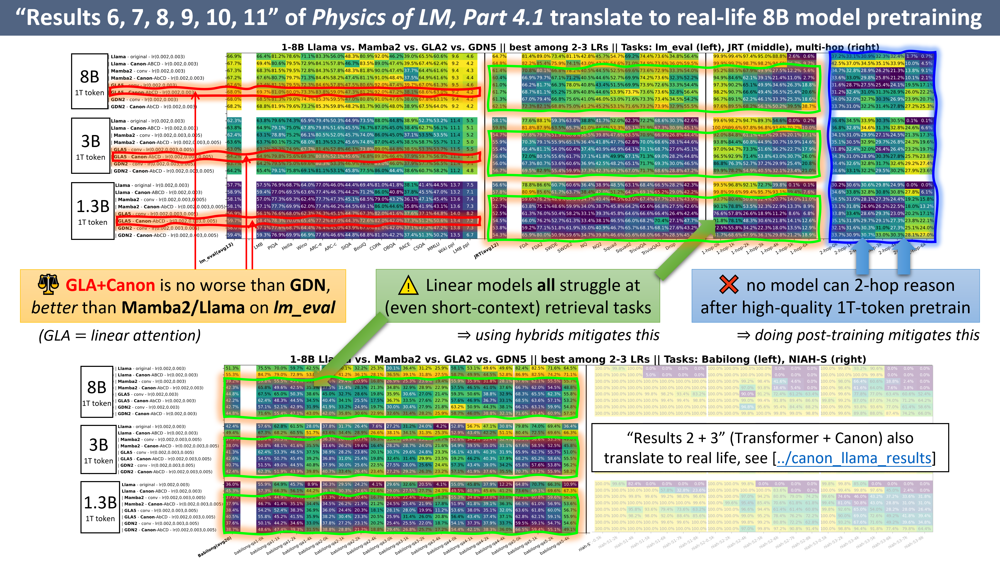
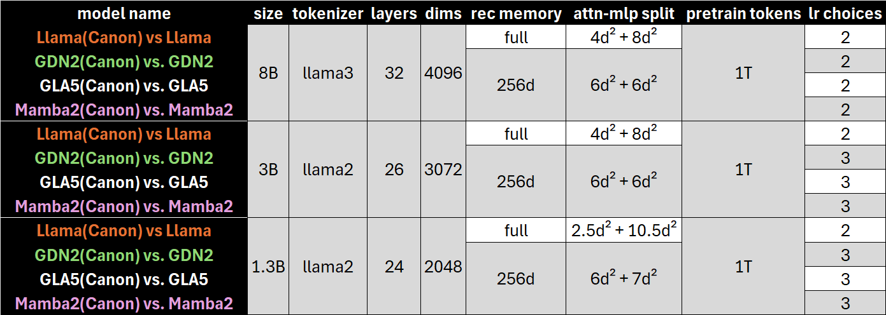
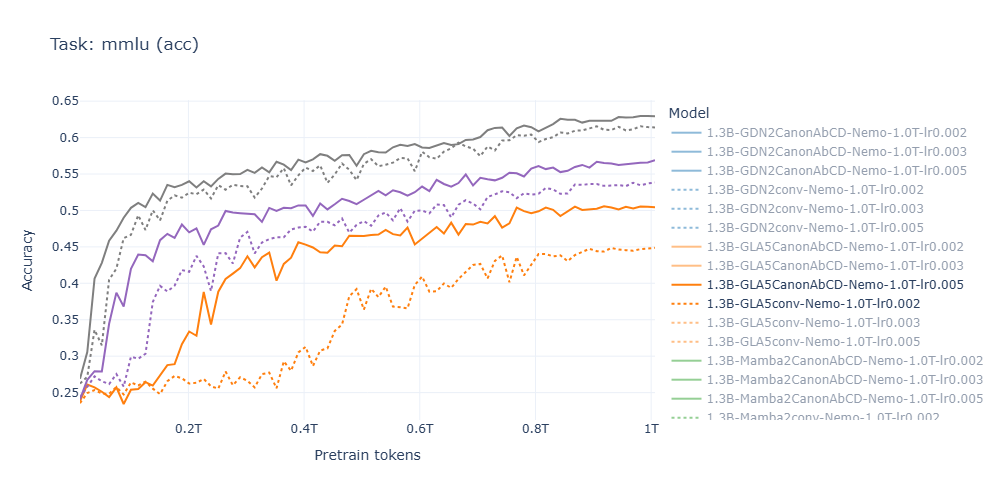
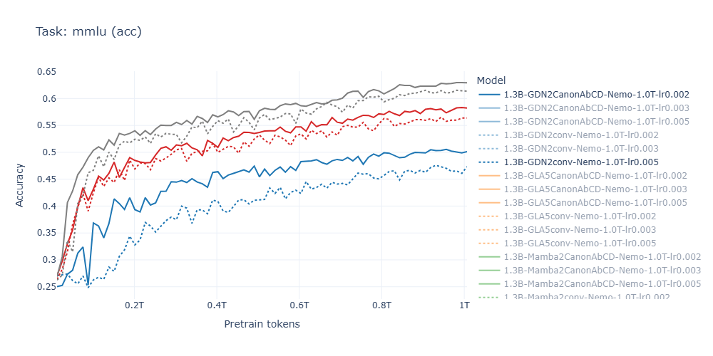

# Physics of Language Models: Part 4.2, Canon Layers at Scale where Synthetic Pretraining Resonates in Reality
## Linear Model + Canon Layers

**Author**: Zeyuan Allen-Zhu  

This release extends our paper, [*Physics of Language Models: Part 4.1 — Architecture Design and the Magic of Canon Layers*](https://ssrn.com/abstract=5240330), which demonstrates that the **Canon layer** is a powerful architectural add-on that consistently improves language model performance—arguably across *all* architectures, from standard Transformers to linear models.

In our [previous release](../canon_llama_results/), we showed that these findings generalize to real-world 1B/3B/8B Transformer pretraining: the resulting **LlamaCanon** models significantly outperform their vanilla *Llama* counterparts.  

🔴 In this **second release**, we pretrain 1–8B parameter **linear models**—including **Gated Linear Attention (GLA)**, **Gated DeltaNet (GDN)**, and **Mamba2**—both *with* and *without* Canon layers.  
We carefully control data (same [Nemotron-CC](https://arxiv.org/pdf/2412.02595) and sampling), architecture (e.g., sub-layer width and division, recurrent memory size), and optimization settings to enable the strongest possible *apple-to-apple* comparison across:
1. Linear models (GLA/GDN/Mamba2) vs. Transformers, and  
2. Architectures with vs. without Canon layers.

---

## 🔍 Highlights of Findings

1. **Canon layers yield significant gains** for GLA (linear attention), even when the base model already includes Conv1D mixing.  
   - Noticeable gains are also seen on GDN, though smaller on Mamba2.  
   - These results **validate synthetic findings (Results 6–8)** in [our Part 4.1 paper](https://ssrn.com/abstract=5240330).

2. **GLA + Canon** matches or exceeds the performance of GDN and even outperforms Mamba2 across 1B/3B/8B-scale pretraining benchmarks.  
   - This confirms **Result 9**, showing that many of the performance gains traditionally attributed to newer linear architectures like GDN or Mamba2 largely **vanish once Canon layers are introduced**. 
   - Much of these gains can be explained by the simpler **horizontal information mix** provided by Canon layers, suggesting that the **current direction of linear-model architecture design may warrant re-evaluation**.
   - The observed ranking differences align closely with **Result 10** from the synthetic pretraining playground, highlighting the strong **transferability** of synthetic findings to large-scale real-world pretraining.

3. **All linear models struggle with in-context retrieval**, even for short contexts (≈100 tokens).  
   - This supports **Result 11**: current linear designs remain limited in retrieval and multi-hop reasoning—explaining the emergence of hybrid architectures (e.g., *Qwen3-Next* with Transformer–GDN, *Falcon H1* with Transformer–Mamba2) to mitigate these weaknesses.

4. **Two-hop reasoning remains hard** even at 8B-scale pretraining with 1T high-quality tokens, for both Transformer and linear models.  
   - This highlights a general limitation of *all current architectures* in the pretraining regime and motivates the growing reliance on post-training methods.

<div align="center">
  
  <em><b>Figure 1:</b> Summary of main performance findings.</em>
</div>

---

## ⚙️ Model Configurations


We pretrained **48 linear models** using *1T tokens* from the high-quality [Nemotron-CC](https://arxiv.org/pdf/2412.02595) dataset.
- **No cherry-picking**: For 1B and 3B models, we tested *3 learning rates*; for 8B models, *2 learning rates*.  
- **Controlled architecture**: Model specs were tightly aligned to ensure fairness. For example, a 3B linear model (hidden size d = 3072) has  
  - ~6 d² parameters per GLA/GDN/Mamba layer, and  
  - ~6 d² per MLP layer,  
  with a **recurrent memory size of 256 d (+ Conv1D)** across all variants.  
- **Controlled training**: Training hyperparameters are identical (see [table-params.png](table-params.png)).  
- **Comparison to Llama**: The *Llama* baselines use the similar architecture and data, trained under comparable settings, ensuring a fair and interpretable comparison.

A summary of the 48 models and their parameters is shown below:  

<div align="center">

<br/>
<em><b>Figure 2:</b> Overview of model configurations and parameter counts.</em>
</div>


Full configurations:  
- Linear models → [canon_linear_recipes](../canon_linear_recipes) or [table-params.png](table-params.png)  
- Transformers → [canon_llama_recipes](../canon_llama_recipes) or [../canon_llama_results/table-params.png](../canon_llama_results/table-params.png)


---

## 📊 Evaluation Metrics


Following [our paper](https://ssrn.com/abstract=5240330), we evaluate using a comprehensive suite of metrics:

* [`lm-evaluation-harness`](https://github.com/EleutherAI/lm-evaluation-harness) — Standard benchmarks (e.g., HellaSwag, MMLU)  
* [*Just Read Twice* (JRT)](https://arxiv.org/abs/2407.05483) — Generative and retrieval-focused tasks  
* [*1-hop / 2-hop retrieval*](https://ssrn.com/abstract=5240330) — Simple in-context birth-year retrieval tasks (0–6k context)  
* [*Babilong*](https://arxiv.org/abs/2406.10149) — Multi-hop in-context reasoning  
* [*NIAH-S*](https://arxiv.org/abs/2404.06654) — Single-needle retrieval benchmarks

As noted in our paper:  
- *Babilong* may be too difficult to reveal fine architectural differences, while *NIAH* may be too easy to be informative.  
- For *lm_eval* and *JRT*, our earlier 1B–100B token experiments showed high noise and weak separation across architectures; at the 1T-token scale, these benchmarks become much more reliable in distinguishing them.

---

## 📈 Training Curves

To illustrate the training-time advantages of Canon layers, we provide full pretraining curves.  
Interactive versions are available in [training-curves-interactive-linear.html](training-curves-interactive-linear.html) (download locally to explore).  
Below is a snapshot:

<div align="center">


<br/>
<em><b>Figure 3:</b> MMLU accuracy vs. training tokens (best learning rate per 1B/3B/8B model).</em>
</div>


## Citation

Please cite the following if you use our models or findings in your research:
```bibtex
@inproceedings{Allen2025-canon,
  author = {{Allen-Zhu}, Zeyuan},
  title = {{Physics of Language Models: Part 4.1, Architecture Design and the Magic of Canon Layers}},
  year = {2025},
  booktitle = {Proceedings of the 39th Conference on Neural Information Processing Systems},
  series = {NeurIPS~'25},
  note = {Full version available at \url{https://ssrn.com/abstract=5240330}} 
}
@misc{Allen2025-resonate,
    title = {{Physics of Language Models: Part 4.2, Canon Layers at Scale where Synthetic Pretraining Resonates in Reality}},
    author = {{Allen-Zhu}, Zeyuan},
    year = {2025},
    url = {https://physics.allen-zhu.com/part-4-architecture-design/part-4-2},
    note = {Code released at \url{https://github.com/facebookresearch/PhysicsLM4}},
}
```
